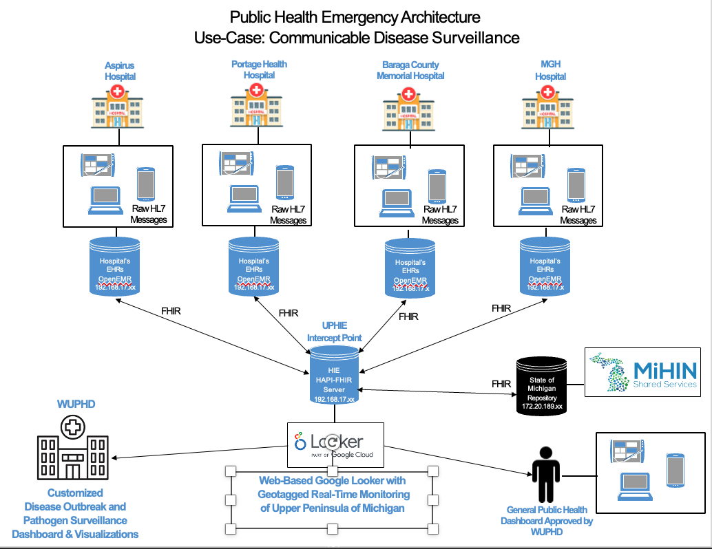

# Public Health Disease Surveillance Architecture
In this semester-long project, I developed a model architecture for public health surveillance for COVID-19 in Michigan's Upper Peninsula, implementing virtual machines, OpenEMR, Synthea, and Hapi-FHIR.

## Components

### Virtual Machines
For this project, I configured and utilized five Ubuntu Linux machines on VMWare vSphere. As seen in the schematic above, four represented hospitals across the Upper Peninsula, and one served as a health information exchange.

### OpenEMR
For each hospital, I successfully deployed and configured OpenEMR v6.0.0 on an Ubuntu Server environment, implementing a full LAMP stack (Linux, Apache, MySQL, and PHP). The database was [secured](https://github.com/agtoyli/Public-Health-Disease-Surveillance/blob/main/security_script.txt) via mysql_secure_installation and managing service-level permissions for the user. I finalized the deployment by executing the web-based setup utility, ensuring the application was fully integrated with the backend database.

### Synthea
I generated synthetic patient data for each hospital using Synthea and the Java Development Kit (JDK). By configuring specific demographic parameters and clinical modules, I generated over 1800 total patient records in JSON format. This process involved executing targeted CLI commands to model varying outbreak levels for the different hospitals, creating a privacy-compliant dataset for syndromic surveillance testing and public health simulation within the OpenEMR environment.

### Hapi-FHIR
I architected and deployed a regional HAPI FHIR Server to serve as a centralized interoperability hub for health data exchange. Leveraging Docker for containerization, I orchestrated a lightweight, scalable environment using the HAPI FHIR JPA Starter image. The deployment involved configuring an application.yaml override to optimize the server for an H2 database backend and mapping host ports to facilitate external traffic.

Following the server deployment, I validated the infrastructure by performing full CRUD (Create, Read, Update, Delete) operations via the RESTful API. Using Postman and Swagger UI, I successfully implemented healthcare workflows, including creating and querying Practitioner resources in FHIR JSON format. This project demonstrates a complete end-to-end HIE lifecycle, from system hardening and container management to the technical exchange of standardized healthcare data across simulated regional institutions.
